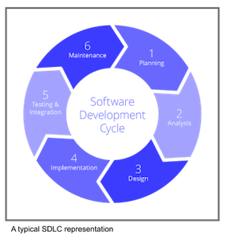

---

title: Secure Development and Integration
layout: col-document
tags: OWASP Developer Guide
contributors: Jon Gadsden
document: OWASP Developer Guide
order: 402

---



### 2.2 Secure development and integration

Secure development is described in the OWASP Software Assurance Maturity Model [(SAMM)][samm]
by the Design, Implementation and Verification business functions.
Much of the material in this section is drawn from the OWASP [Integration Standards project][ois].

#### Overview

Almost all modern software is developed in an iterative manner passing through phase to phase,
such as identifying customer requirements, implementation and test.
Theses phases are revisited in a cyclic manner throughout the lifetime of the application.
A generic Software Development LifeCycle (SDLC) is shown below, and in practice there may be more or less phases
according to the processes adopted by the business.

{: height="220px" }

With the increasing number and sophistication of exploits against almost every application or business system,
most companies have adopted a secure Software Development LifeCycle (SDLC).
The secure SDLC should never be a separate lifecycle,
it must always be the same Software Development LifeCycle as before but with security actions built into each phase,
otherwise the security actions will be set aside by busy development teams.
Note that although the Secure SDLC could be written as 'SSDLC' it is almost always written as 'SDLC'.

DevOps integrates and automates many of the SDLC phases and implements Continuous Integration (CI)
and Continuous Delivery/Deployment (CD) pipelines to provide much of this automation.
DevOps and pipelines have been successfully exploited with serious large scale consequences
and so, in a similar manner to the SDLC, much of the DevOps actions have also had to have security built in.
Secure DevOps, or DevSecOps, builds security practices into the DevOps activities to guard against attack
and to provide the SDLC with automated security testing.
Examples of how DevSecOps is 'building security in' is the provision of
Interactive, Static and Dynamic Application Security Testing (IAST, SAST & DAST)
and implementing supply chain security, and there are many other security activities that can be applied.

#### Secure development lifecycle

Referring to the OWASP [Application Wayfinder][ois] development cycle
there are four phases during application development: Requirements, Design, Implementation and Verification.
There are other phases that are done less often in the development cycle and these form an equally important
part of the SDLC: Gap Analysis, Metrics, Operation and Training & Culture Building.

All of these phases of the SDLC should have security activities built into them,
rather than done as separate activities. If security is built into these phases then the overhead becomes much less
and the resistance from the development teams decreases. The goal is for the secure SDLC to become as familiar
a process as before, with the development teams taking ownership of the security activities within each phase.

There are many OWASP tools and resources to help build security into the SDLC.

* Requirements: this phase determines the functional, non-functional and security requirements for the application.
    Requirements should be revisited periodically and check for completeness and validity,
    and it is worth considering various OWASP tools;
    the [Application Security Verification Standard (ASVS)][asvs] provides developers
    with a list of requirements for secure development,
    the [Mobile Application Security][mas] project provides a security standard for mobile applications
    and [SecurityRAT][srat] helps identify an initial set of security requirements.

* Design: it is important to design security into the development - it is never too late to do this
    but the earlier the better (and easier). OWASP provides two tools, [Pythonic Threat Modeling][pytm]
    and [Threat Dragon][td], for threat modeling along with security gamification using [Cornucopia][cornucopia].

* Implementation: the OWASP [Top 10 Proactive Controls][proactive10] project states that they are
    "the most important control and control categories that every architect and developer should absolutely,
    100% include in every project" and this is certainly good advice. Implementing these controls can provide
    a high degree of confidence that the application or system will be reasonably secure.
    OWASP provides two libraries that can be incorporated in web applications,
    the [Enterprise Security API (ESAPI)][esapi] security control library
    and [CSRFGuard][csrf] to mitigate the risk of Cross-Site Request Forgery (CSRF) attacks,
    that help implement these proactive controls. In addition the OWASP [Cheat Sheet Series][cheat] is a valuable source
    of information and advice on all aspects of applications security.

* Verification: OWASP provides a relatively large number of projects that help with testing and verification.
   This is the subject of a section in this Developer Guide, and the projects are listed below.

* Training: development teams continually need security training. Although not part of the inner SDLC iterative loop,
   training should be factored into the project lifecycle.
   OWASP provides many training environments and materials - see the list at the end of this section.

* Culture Building: a good security culture within a business organization will help greatly in keeping
   the applications and systems secure. There are many activities that all add up to create the
   security culture, the OWASP [Security Culture][culture] project goes into more detail on these activities,
   and a good Security Champion program within the business is foundational to a good security posture.
   The OWASP [Security Champions Guide][champions] provides guidance and material to create security champions
   within the development teams - ideally every team should have a security champion that has
   a special interest in security and has received further training, enabling the team to build security in.

* Operation: the OWASP [DevSecOps Guideline][devsecops] explains how to best implement a secure pipeline,
    using best practices and introducing automation tools to help 'shift-left'.
    Refer to the DevSecOps Guideline for more information on any of the topics within DevSecOps
    and in particular sections on Operation.

* Supply chain: attacks that leverage the supply chain can be devastating
    and there have been several high profile of products being successfully exploited.
    A Software Bill of Materials (SBOM) is the first step in avoiding these attacks and
    it is well worth using the OWASP [CycloneDX][cyclone] full-stack Bill of Materials (BOM) standard
    for risk reduction in the supply chain.
    In addition the OWASP [Dependency-Track][deptrack] project is a Continuous SBOM Analysis Platform
    which can help prevent these supply chain exploits by providing control of the SBOM.

* Third party libraries: keeping track of what third party libraries are included in the application,
    and what vulnerabilities they have, is easily automated. Many public repositories such as [github][github]
    and [gitlab][gitlab] offer this service along with some commercial vendors.
    OWASP provides the [Dependency-Check][depcheck] Software Composition Analysis (SCA) tool
    to track external libraries.

* Application security testing: there are various types of security testing that can be automated on pull-request,
   merge or nightlies - or indeed manually but they are most powerful when automated. Commonly there is
   Static Application Security Testing (SAST), which analyses the code without running it,
   Dynamic Application Security Testing (DAST), which applies input to the application while running it in a sandbox
   or other isolated environment.
   Interactive Application Security Testing (IAST) on the other hand is designed to be run manually as well,
   providing instant feedback on the tests as they are run.

#### Further reading from OWASP

* [Cheat Sheet Series][cheat]
* [Cornucopia][cornucopia]
* [CycloneDX Bill of Materials (BOM) standard][cyclone]
* [DevSecOps Guideline][devsecops]
* [Security Champions Guide][champions]
* [Security Culture project][culture]
* [Top 10 Proactive Controls][proactive10]

#### OWASP verification projects

* [Amass project][amass]
* [Code Pulse][pulse]
* [Defect Dojo][dojo]
* [Mobile Application Security (MAS)][mas]
* [Nettacker][net]
* [OWTF][owtf]
* [Web Security Testing Guide (WSTG)][wstg]
* [Zed Attack Proxy (ZAP)][zap]

#### OWASP training projects

* [API Security Project][api]
* [Juice Shop][juice]
* [Mobile Top 10][mobile10]
* [Security Shepherd][shepherd]
* [Snakes And Ladders][snakes]
* [Top Ten Web Application security risks][top10]
* [WebGoat][goat]

#### OWASP resources

* [Application Security Verification Standard (ASVS)][asvs]
* [CSRFGuard library][csrf]
* [Dependency-Check Software Composition Analysis (SCA)][depcheck]
* [Dependency-Track Continuous SBOM Analysis Platform][deptrack]
* [Enterprise Security API (ESAPI)][esapi]
* [Integration Standards project Application Wayfinder][ois]
* [Mobile Application Security (MAS)][mas]
* [Pythonic Threat Modeling][pytm]
* [Threat Dragon][td]
* [SecurityRAT (Security Requirement Automation Tool)][srat]

----

The OWASP Developer Guide is a community effort; if there is something that needs changing
then [submit an issue][issue0402] or a [pull request][pr] .

[amass]: https://owasp.org/www-project-amass/
[api]: https://owasp.org/www-project-api-security/
[asvs]: https://owasp.org/www-project-application-security-verification-standard/
[cheat]: https://owasp.org/www-project-cheat-sheets/
[cornucopia]: https://owasp.org/www-project-cornucopia/
[csrf]: https://owasp.org/www-project-csrfguard/
[champions]: https://owasp.org/www-project-security-champions-guidebook/
[culture]: https://owasp.org/www-project-security-culture/
[cyclone]: https://owasp.org/www-project-cyclonedx/
[depcheck]: https://owasp.org/www-project-dependency-check/
[deptrack]: https://dependencytrack.org/
[devsecops]: https://owasp.org/www-project-devsecops-guideline/
[dojo]: https://www.defectdojo.org/
[esapi]: https://owasp.org/www-project-enterprise-security-api/
[github]: https://github.com/
[gitlab]: https://about.gitlab.com/
[goat]: https://owasp.org/www-project-webgoat/
[issue0402]: https://github.com/OWASP/www-project-developer-guide/issues/new?labels=enhancement&template=request.md&title=Update:%2004-foundations/02-secure-development
[juice]: https://owasp.org/www-project-juice-shop/
[mas]: https://mas.owasp.org/
[mobile10]: https://owasp.org/www-project-mobile-top-10/
[net]: https://owasp.org/www-project-nettacker/
[ois]: https://owasp.org/www-project-integration-standards/
[owtf]: https://owasp.org/www-project-owtf/
[pr]: https://github.com/OWASP/www-project-developer-guide/pulls
[proactive10]: https://owasp.org/www-project-proactive-controls/
[pulse]: https://owasp.org/www-project-code-pulse/
[pytm]: https://owasp.org/www-project-pytm/
[samm]: https://owaspsamm.org/about/
[shepherd]: https://owasp.org/www-project-security-shepherd/
[snakes]: https://owasp.org/www-project-snakes-and-ladders/
[srat]: https://owasp.org/www-project-securityrat/
[td]: https://owasp.org/www-project-threat-dragon/
[top10]: https://owasp.org/www-project-top-ten/
[wstg]: https://owasp.org/www-project-web-security-testing-guide/
[zap]: https://www.zaproxy.org/

\newpage
