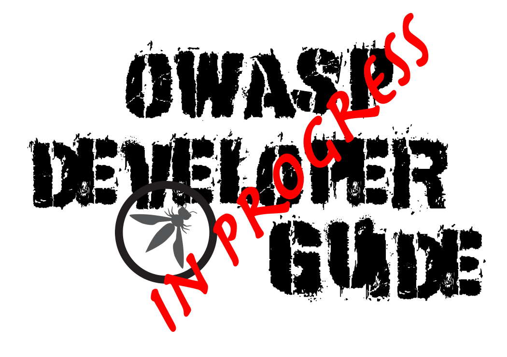

---

title: Implementation Do's and Don'ts
layout: col-document
tags: OWASP Developer Guide
contributors:
document: OWASP Developer Guide
order:

---



{height=180px}

### 12.1 Implementation Do's and Don'ts

No hay traducción para esta página, consulte [versión original en inglés][release0740].

Sections:

12.1.1 [Container security](#container-security)  
12.1.2 [Secure coding](#secure-coding)  
12.1.3 [Cryptographic practices](#cryptographic-practices)  
12.1.4 [Application spoofing](#application-spoofing)  
12.1.5 [Content Security Policy (CSP)](#content-security-policy)  
12.1.6 [Exception and error handling](#exception-and-error-handling)  
12.1.7 [File management](#file-management)  
12.1.8 [Memory management](#memory-management)  

----

[release0740]: https://github.com/OWASP/www-project-developer-guide/blob/main/release/14-appendices/01-implementation-dos-donts/toc.md

\newpage
