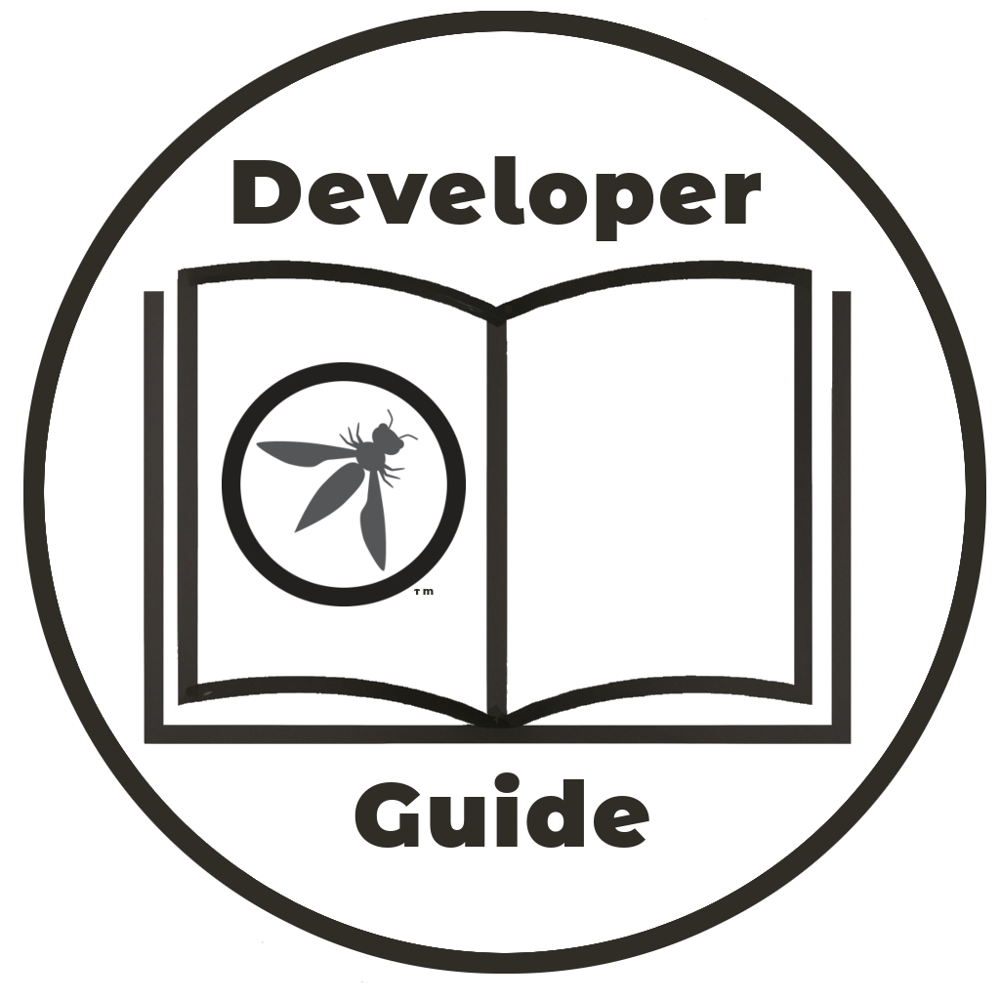

---

title: Foundations
layout: col-document
tags: OWASP Developer Guide
contributors:
document: OWASP Developer Guide
order:

---



{height=180px}

## 2. Fundamentos

Existem vários conceitos e terminologias fundamentais que são comumente usados ​​em segurança de software.
Embora muitos desses conceitos sejam complexos de implementar e sejam baseados na teoria heavy-duty,
os princípios costumam ser bastante simples e acessíveis a todos os engenheiros de software.

Uma compreensão razoável desses conceitos fundamentais permite que as equipes de desenvolvimento entendam e implementem
segurança de software para o aplicativo ou sistema em desenvolvimento.
Este Guia do desenvolvedor oferece apenas uma breve visão geral desses conceitos,
para conhecimento aprofundado, consulte os diversos textos sobre segurança, como o [The Cyber ​​Security Body Of Knowledge][cbok].

If changes are being introduced to the security culture of an organization
then make sure there is management buy-in and clear goals to achieve.
Without these then attempts to improve the security posture will probably fail - see the
[Security Culture][culturegoal] project for the importance of getting management,
security and development teams working together.

Seções:

2.1 [Fundamentos de segurança](#security-fundamentals)  
2.2 [Desenvolvimento e integração seguros](#secure-development-and-integration)  
2.3 [Princípios de segurança](#principles-of-security)  
2.4 [Princípios de criptografia](#principles-of-cryptography)  
2.5 [OWASP Top 10](#owasp-top-ten)  

----

O Guia do Desenvolvedor da OWASP é um trabalho da comunidade; se há algo que precisa ser mudado então [submeta uma issue][issue0400].

[cbok]: https://www.cybok.org/
[culturegoal]: https://owasp.org/www-project-security-culture/stable/3-Goal_Setting_and_Security_Team_Collaboration/
[issue0400]: https://github.com/OWASP/www-project-developer-guide/issues/new?labels=enhancement&template=request.md&title=Update:%2004-foundations/00-toc
